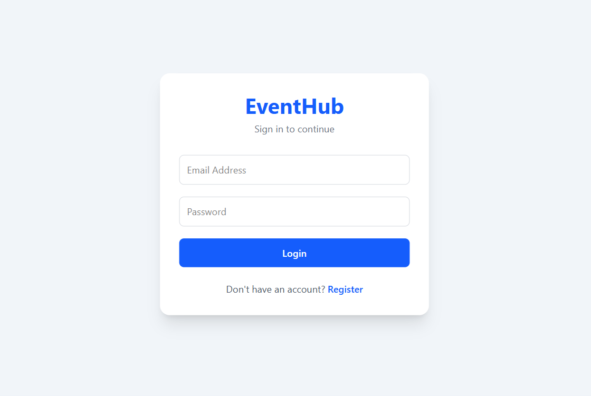
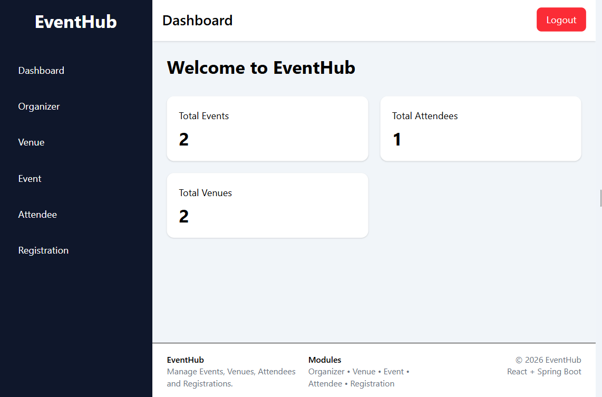

# EventHub - Event Management System

A full-stack Event Management System built using React.js, Spring Boot, Spring Data JPA, MySQL, and JWT Authentication.

## Features

### Authentication

* User Registration
* User Login
* JWT Authentication
* Protected Routes
* Logout Functionality

### Organizer Management

* Create Organizer
* View Organizer by ID

### Venue Management

* Create Venue
* View Venue by ID
* Venue List with Pagination & Sorting

### Event Management

* Create Event
* View Event by ID
* Update Event
* Delete Event
* Event List with Pagination & Sorting
* View Event Attendees

### Attendee Management

* Create Attendee
* View Attendee by ID
* Update Attendee
* Delete Attendee
* Attendee List with Pagination & Sorting

### Registration Management

* Create Registration
* View Registration by ID
* Delete Registration
* View Registrations by Event

### Dashboard

* Total Events Count
* Total Attendees Count
* Total Venues Count
* Dynamic Navigation
* Responsive Layout

---

## Tech Stack

### Frontend

* React.js
* React Router DOM
* Axios
* Tailwind CSS

### Backend

* Spring Boot
* Spring Data JPA
* Spring Security
* JWT Authentication
* Lombok

### Database

* MySQL

---

## Project Structure

Frontend

src/
├── pages/
├── services/
├── components/
├── context/
├── routes/
└── api/

Backend

src/main/java/com/eventhub/
├── controller/
├── service/
├── repository/
├── entity/
├── dto/
├── exception/
└── security/

---

## API Endpoints

### Auth

POST /api/auth/register

POST /api/auth/login

### Organizer

POST /api/organizers

GET /api/organizers/{id}

### Venue

POST /api/venues

GET /api/venues/{id}

GET /api/venues

### Event

POST /api/events

GET /api/events/{id}

PUT /api/events/{id}

DELETE /api/events/{id}

GET /api/events

GET /api/events/{eventId}/attendees

### Attendee

POST /api/attendees

GET /api/attendees/{id}

PUT /api/attendees/{id}

DELETE /api/attendees/{id}

GET /api/attendees

### Registration

POST /api/registrations

GET /api/registrations/{id}

DELETE /api/registrations/{id}

GET /api/registrations/event/{eventId}

---

## Screenshots

### Login Page

### Dashboard

---

## Installation

### Clone Repository

git clone https://github.com/your-username/eventhub.git

### Backend Setup

1. Open project in IntelliJ IDEA
2. Configure MySQL database
3. Update application.properties
4. Run Spring Boot Application

### Frontend Setup

npm install

npm run dev

---

## Database Configuration

spring.datasource.url=jdbc:mysql://localhost:3306/eventhub

spring.datasource.username=root

spring.datasource.password=your_password

spring.jpa.hibernate.ddl-auto=update

---

## Future Enhancements

* Dashboard Analytics
* Advanced Search
* Export Reports
* Email Notifications
* Role Based Access Control
* Event Calendar Integration

---

## Author

Sanwariya Sukhwal

Full Stack Developer

React.js | Spring Boot | Java | PostgreSql

---

